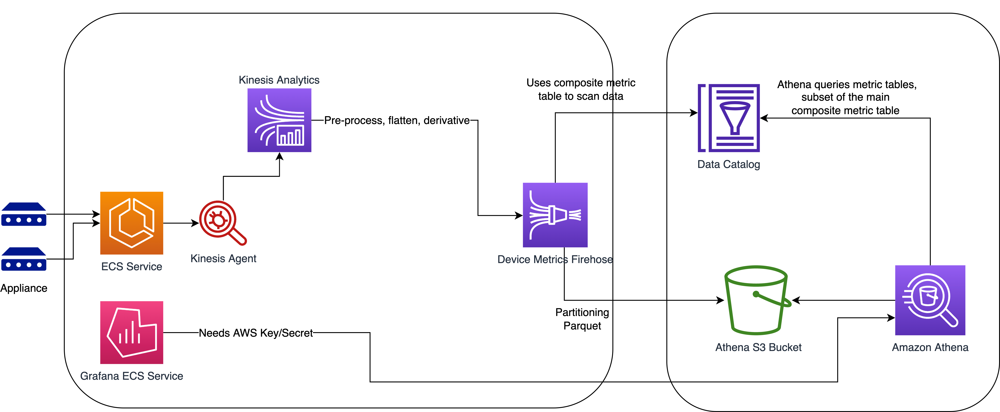

# AWS Kinesis Analytics

AWS Kinesis Analytics is a demo project were metric data from computers (machines) are collected and processed using AWS Kinesis Analytics to ultimately store in Athena Database.
This computer metric data in Athena can be used further to drive alerts and also for monitoring using tools such as Grafana. 

## Kinesis Data Analytics

Kinesis Data Analytics uses Flink operations to pe-process, aggregate and calculate derivative for metric data.

    $ gradle clean build -x test

## Infrastructure Setup

Execute the below terraform commands to deploy the resources.

    $ terraform init
    $ terraform plan
    $ terraform apply -auto-approve -input=false

Follow the instructions in [Metrics Generator](metrics-generator/README.md) repository to generate mock data that is added to Kinesis Firehose.
